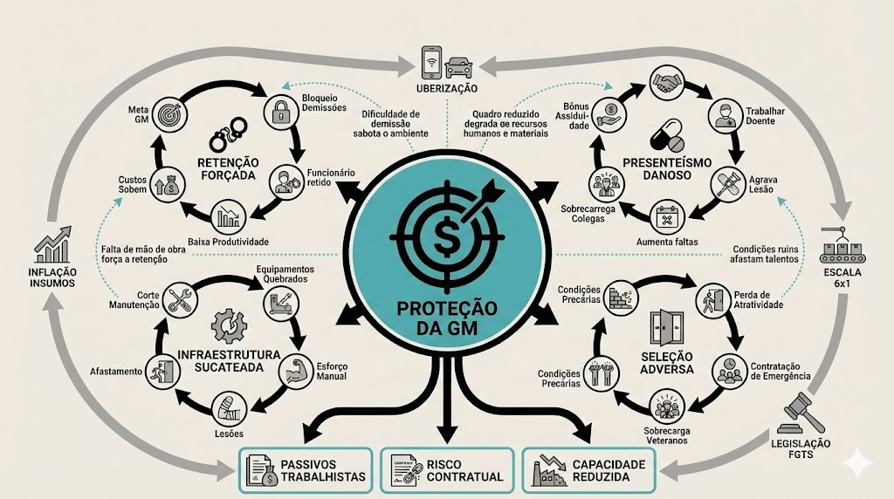

# Arquitetura de incentivos e o impacto operacional

A margem de lucro reportada trimestralmente pela operação Sodexo não captura os passivos que estão sendo acumulados. Este estudo revela como a estrutura de metas financeiras, desenhada para maximizar retorno de curto prazo, está gerando custos ocultos que ameaçam a sustentabilidade contratual e a continuidade dos serviços para clientes como **Leroy Merlin** e **União Química**. Identificamos uma cadeia de incentivos que, embora focada na margem de lucro, acaba gerando precarização, adoecimento e deterioração do clima organizacional.

---

## O custo invisível da margem

Antes de detalhar os mecanismos, é fundamental traduzir os achados qualitativos em linguagem de **risco financeiro**. A margem de lucro reportada mensalmente não captura os passivos que estão sendo acumulados:

| Mecanismo Identificado | Passivo Oculto Correspondente |
|------------------------|-------------------------------|
| **Bloqueio de demissões** | Produtividade perdida por funcionários desengajados; custo de oportunidade de não renovar equipes |
| **Presenteísmo forçado** | Afastamentos INSS prolongados (custo médio de R$ 8.000 a R$ 15.000 por caso); risco de ações por condições de trabalho |
| **Desvio de função** | Passivo trabalhista estimado em 5 a 7 anos de diferenças salariais por funcionário; risco de ação coletiva |
| **Sucateamento de infraestrutura** | Acidentes de trabalho com afastamento (deflator na PLR + indenizações); falhas de segurança alimentar (multas contratuais) |
| **Rotatividade alta** | Custo de recrutamento e treinamento (estimado em 2 a 3 salários por vaga reposta) |

> **Nota para a alta gestão:** A economia de curto prazo em manutenção, pessoal e rescisões está sendo paga com passivos trabalhistas, operacionais e contratuais que não aparecem no resultado mensal. A margem reportada mascara sua própria insustentabilidade.

Os custos listados acima não são projeções especulativas. São passivos documentados em análises jurídicas de empresas do setor, com precedentes de ações coletivas e individuais. A questão não é *se* esses custos serão cobrados, mas *quando*.

---

## 1. A tensão central: Metas de lucro versus sustentabilidade operacional

A margem bruta de lucro (referida internamente como **Gross Margin - GM**) funciona como o principal indicador de desempenho das operações. No modelo da Sodexo, este número é definido anualmente pela diretoria e cascateado para as Gerências de Unidade (GUs). O orçamento é estático: uma vez definido, não há flexibilidade para remanejamento de verbas entre unidades, mesmo diante de colapsos estruturais.

A remuneração variável (PLR) das lideranças da Sodexo está diretamente atrelada ao atingimento dessa meta de GM. O modelo opera em uma lógica de "gatilho binário": se a meta financeira não for batida, a bonificação é zerada; se for atingida, a liderança pode receber até dois salários extras.

Além do gatilho financeiro, existem "deflatores" que penalizam a bonificação mesmo quando a meta de lucro é alcançada:
- Índices de rotatividade acima do esperado
- Ocorrências de segurança alimentar ou acidentes de trabalho

Este modelo cria um conflito de interesses estrutural. Para garantir sua própria remuneração, as lideranças locais são incentivadas a cortar custos operacionais, incluindo aqueles considerados essenciais para a segurança e qualidade.

---

## 2. Os incentivos que operam contra a organização

A análise das entrevistas revelou quatro mecanismos distintos que geram comportamentos destrutivos:

### 2.1 A armadilha orçamentária
**Como funciona:** Cada despesa da unidade (manutenção, compras, rescisões) é debitada diretamente do centro de custo local e afeta a margem de lucro.

**Consequências observadas:**
- Manutenções críticas são adiadas (fornos quebrados há mais de dois anos, ar-condicionado defeituoso)
- Equipamentos básicos não são repostos (liquidificadores, batedeiras, facas)
- A equipe é forçada a improvisar soluções manuais, aumentando o esforço físico

### 2.2 O bloqueio das demissões
**Como funciona:** As verbas rescisórias (multa do FGTS, aviso prévio) saem do orçamento da unidade. Não existe um fundo centralizado para desligamentos.

**Consequências observadas:**
- Funcionários insatisfeitos ou improdutivos são mantidos no quadro porque desligá-los comprometeria a meta de lucro
- Colaboradores que desejam sair percebem que a empresa evita demitir; alguns passam a adotar comportamentos de baixa produtividade para forçar o desligamento
- A permanência de pessoas desengajadas contamina o clima e sobrecarrega quem trabalha
    
    Este mecanismo financeiro cria o fenômeno que detalhamos como o **[Travamento Rescisório e a armadilha do FGTS](#03)**.

É importante notar: o comportamento de baixa produtividade observado não é uma "falha de caráter" individual. Trata-se de uma **resposta racional a um sistema de incentivos**. Quando o trabalhador percebe que a empresa não o demitirá (por restrições orçamentárias) e que pedir demissão significa perder anos de FGTS acumulado, a estratégia de forçar o desligamento se torna lógica dentro das opções disponíveis. A responsabilidade pela disfunção é do desenho do sistema, não do indivíduo.

### 2.3 A penalização da saúde (Cesta assiduidade)
**Como funciona:** O bônus de assiduidade (denominado "Cesta", no valor aproximado de **R$ 300,00**) é condicionado à frequência perfeita. Na Sodexo, a regra é rigorosa: uma única falta ou mesmo a apresentação de atestado médico no mês resulta na perda integral do benefício.

**Consequências observadas:**
- Colaboradores vão trabalhar doentes para não perder parte significativa da renda
- Lesões tratáveis se tornam crônicas por falta de repouso (tendinites, problemas de coluna)
- Em operações de alimentação, pessoas doentes manipulando alimentos representa risco sanitário

    Essa política é o principal motor do **[Presenteísmo Danoso e do adoecimento mental](#02)** que mapeamos nas equipes.

### 2.4 O desvio de função estrutural
**Como funciona:** Para reduzir custos com folha de pagamento, a maioria é contratada como "Auxiliar de Serviços Gerais", mas executa tarefas de cozinheiro, estoquista ou açougueiro.

**Consequências observadas:**
- O colaborador percebe que faz trabalho qualificado por salário mínimo
- A empresa se torna um "bico" temporário até surgir oportunidade melhor
- A falta de especialização leva a erros de produção e desperdício de insumos

### 2.5 PLR da ponta: A economia como métrica
**Detalhes:** Diferente das lideranças, o incentivo para cozinheiros e auxiliares está atrelado à capacidade da unidade de economizar recursos.
- **O Conflito:** Isso pode incentivar a restrição no uso de materiais básicos e EPIs (ex: luvas, panos) para não onerar as despesas e proteger o bônus, gerando improvisos perigosos.

### 2.6 Os deflatores: Subtração do resultado
**Detalhes:** O sistema possui "travas" que reduzem o montante a ser recebido por fatores sistêmicos:
- **Segurança e Acidentes:** Acidentes com afastamento são deflatores críticos. Aqui reside uma contradição: o bônus de assiduidade força o trabalho doente, o que eleva o risco de acidentes, que por sua vez penaliza a PLR de toda a equipe e da gestão.
- **Auditorias (Regra de Ouro):** Falhas em auditorias de qualidade e segurança resultam em multas contratuais que impactam diretamente o valor distribuído.

---

## 3. A pressão do sistema de metas

O sistema de metas de proteção a margem da Sodexo cria uma "pressão cruzada" que atravessa todos os níveis, onde a volatilidade do mercado é repassada para a ponta sem a flexibilidade correspondente:

### 3.1 Nível estratégico: Gerência de operações (GO)
Representado pela gestão de portfólio (ex: 38 unidades), este nível atua sob a métrica de resultado agregado.
*   **A Interdependência:** Quando ocorre a perda de um contrato por decisões estratégicas do cliente ou concorrência, a meta financeira global permanece inalterada. 
*   **O Efeito cascata:** Isso gera uma necessidade reativa de buscar margem adicional nas unidades remanescentes (como Cajamar e Guarulhos), pressionando por orçamentos ainda mais restritivos para compensar o portfólio.

### 3.2 Nível tático: Gerência de contas estratégicas (GCE)
As GCEs funcionam como o filtro entre as demandas voláteis do cliente (**União Química** e **Leroy Merlin**) e a rigidez do orçamento interno.
*   **Variações Não Planejadas:** O volume de serviços é definido pela demanda do cliente (ex: picos de refeições), mas o orçamento é estático. 
*   **Dilema do Incentivo:** Medida pela retenção, a GCE tende a absorver novas demandas sem aporte imediato de recursos, impactando diretamente o *Gross Margin* (GM) que a unidade precisa entregar.

### 3.3 Nível operacional-gestor: Gerente de unidade (GU)
O ponto mais crítico da cadeia devido à natureza binária de sua PLR e à alocação de custos rescisórios. **É fundamental reconhecer que a GU não é a autora deste sistema — ela é sua vítima mais visível.** A liderança local opera sob um desenho de incentivos que a coloca em constante conflito ético: para garantir sua própria remuneração, precisa tomar decisões que prejudicam sua equipe.
*   **O Gatilho Binário:** A PLR é condicionada ao atingimento estrito da margem (ex: 7,9% vs 8% zera o bônus). Isso gera um estado de alerta permanente e sofrimento ético.
*   **Barreira de Gestão:** Os custos de demissão debitados na unidade e o **deflator de rotatividade** na PLR incentivam a "retenção involuntária" de funcionários desengajados para proteger o resultado do mês.
*   **Voz da Gestão Local:** As GUs relatam: "Sei do problema, mas não tenho ferramentas. Se liberassem um fundo centralizado para rescisões, eu resolveria metade dessas crises em três meses. Mas enquanto cada demissão sair do meu resultado, vou continuar segurando funcionário-problema."
    
    A falta de autonomia local foi corroborada pelos **[Experimentos da CoP em 2024](#10)**, onde iniciativas de melhoria falharam por falta de budget.

A liderança local identifica a solução, mas não dispõe de autonomia para implementá-la. A criação de um fundo centralizado para rescisões é uma mudança que requer decisão em nível de diretoria, não de gestão de unidade.

### 3.4 Nível de Execução: Colaboradores
A ponta responde à necessidade de economia superior para sustentar as metas.
*   **Ajuste Funcional:** Uso de bônus de assiduidade (presenteísmo) e desvio de função (ASGs executando tarefas de cozinheiro) como variáveis para manter a folha dentro do orçamento.

---

## 5. A síntese do problema: Pressão cruzada

A estrutura observada retira valor do capital humano e da infraestrutura para entregar margem imediata, comprometendo a capacidade futura de geração de valor. A pergunta não é "quanto custa humanizar o orçamento", mas "quanto está custando não fazê-lo". O sistema gera uma pressão cruzada onde:
1.  A **GO/GCE** repassa a volatilidade do mercado para a unidade sem flexibilidade orçamentária.
2.  A **GU** racionaliza recursos básicos e restringe renovações para proteger o gatilho financeiro binário.
3.  O **Colaborador** responde à sobrecarga e à punição da doença com desengajamento ou afastamento médico.

---

