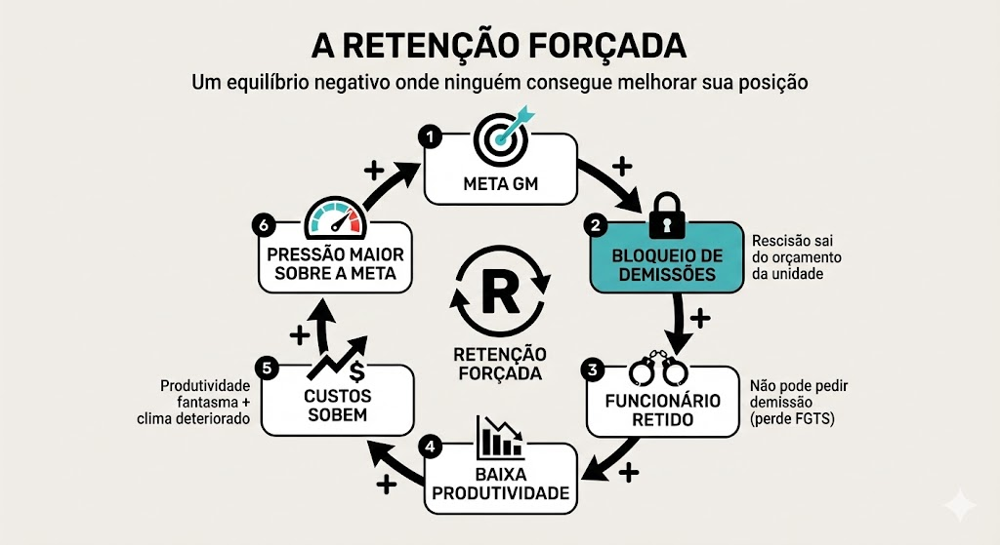
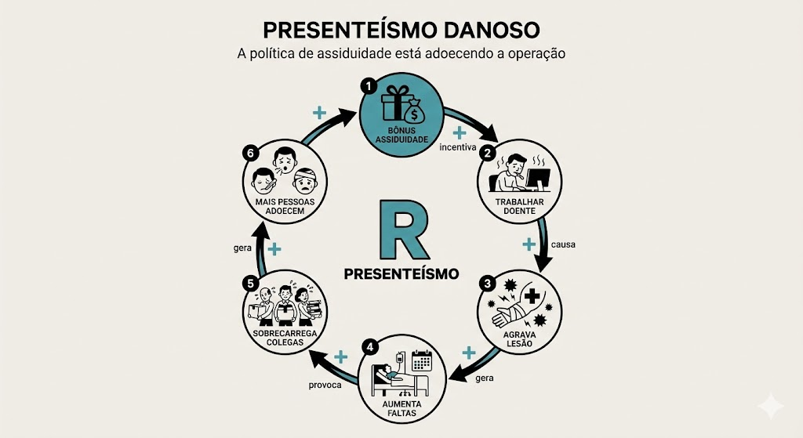
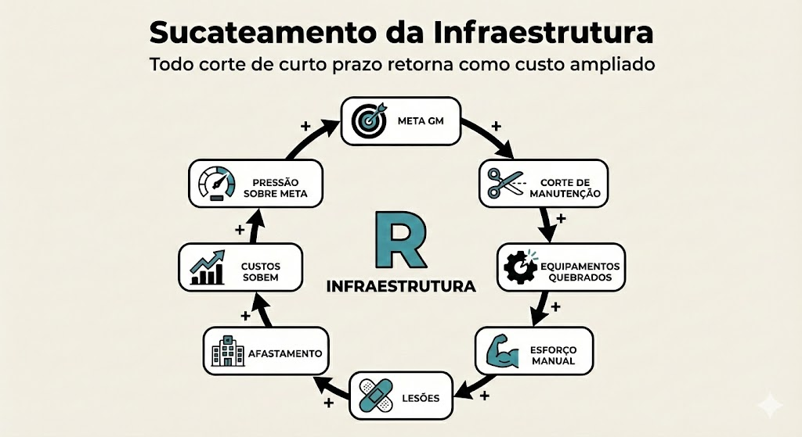
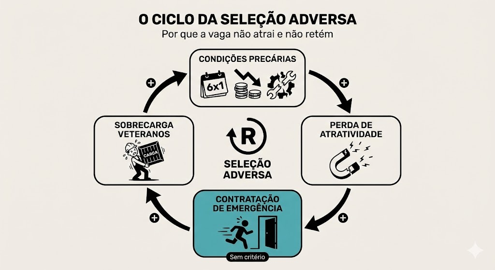

# A Visão Sistêmica do Turnover

A análise revela quatro mecanismos de retroalimentação que perpetuam os problemas de turnover. Os quatro ciclos abaixo não são problemas separados: são **manifestações do mesmo sistema de incentivos**. Cada ciclo alimenta os outros. A retenção forçada sobrecarrega os comprometidos, que adoecem (presenteísmo destrutivo), que são substituídos por equipamentos que quebram (sucateamento), que afasta novos candidatos (seleção adversa). Intervir em um ciclo sem considerar os outros pode ter efeito limitado.

Todos os ciclos convergem para um ponto comum: **a proteção de indicadores financeiros de curto prazo na Sodexo consome o capital humano da operação**, gerando uma estrutura insustentável sustentada por trabalhadores adoecidos e retidos contra sua vontade.

---

### Ciclo 1: Retenção Forçada

`Meta GM → Bloqueio de Demissões → Funcionário retido → Baixa Produtividade → Custos Sobem → (reinicia)`

O ciclo da Retenção Forçada inicia com a pressão por metas de Margem Bruta (GM), o que leva ao bloqueio de demissões para evitar gastos imediatos com rescisões. Isso cria o funcionário retido, que permanece desmotivado para não perder benefícios como o FGTS, resultando em baixa produtividade e um clima organizacional deteriorado. Consequentemente, os custos operacionais sobem devido à ineficiência, o que reduz as margens e gera uma pressão ainda maior sobre as metas, reiniciando o ciclo e aprisionando a empresa em um equilíbrio negativo de curto prazo. Veja a análise profunda deste mecanismo em **[Travamento Rescisório](#03)**.

---

### Ciclo 2: Presenteísmo Danoso

`Bônus Assiduidade → Trabalhar Doente → Agrava Lesão → Aumenta faltas → Sobrecarrega Colegas → (reinicia)`

O ciclo do **Presenteísmo Danoso** inicia com a implementação de um **Bônus de Assiduidade**, que incentiva o colaborador a **trabalhar doente** para não perder a recompensa financeira. Essa exposição contínua **agrava lesões** e condições de saúde preexistentes, o que inevitavelmente **aumenta as faltas** de longo prazo quando o estado de saúde se torna insustentável. A ausência desses profissionais **sobrecarrega os colegas**, gerando um desgaste físico e mental que faz com que **mais pessoas adoeçam** na equipe, retroalimentando o ciclo e prejudicando severamente a produtividade e a saúde da operação como um todo.

---

### Ciclo 3: Sucateamento da Infraestrutura

`Corte de Manutenção → Equipamentos Quebrados → Esforço Manual → Lesões → Afastamento → (reinicia)`

O ciclo do **Sucateamento da Infraestrutura** demonstra que o **Corte de Manutenção** para redução imediata de despesas gera **Equipamentos Quebrados**, obrigando os colaboradores a um **Esforço Manual** excessivo para compensar a falta de maquinário funcional. Esse desgaste físico causa **Lesões**, resultando no **Afastamento** de profissionais e, consequentemente, fazendo com que os **Custos Sobem** devido a ineficiências operacionais e encargos trabalhistas. Com a lucratividade comprometida pelo aumento desses custos, surge uma nova **Pressão Sobre Meta** de Margem Bruta (Meta GM), que incentiva novos cortes de curto prazo e reinicia o processo de degradação estrutural e humana. Este ciclo é alimentado diretamente pelas decisões descritas na **[Arquitetura de Incentivos](#01)**.

---

### Ciclo 4: Seleção Adversa

`Condições Precárias → Perda de Atratividade → Contratação de Emergência → Sobrecarga Veteranos → (reinicia)`

O **Ciclo da Seleção Adversa** tem início com as **Condições Precárias** de trabalho (como escalas 6x1 e baixos salários), o que resulta em uma imediata **Perda de Atratividade** da vaga no mercado. Para suprir a falta de pessoal, a empresa realiza uma **Contratação de Emergência** sem critérios técnicos adequados, o que inevitavelmente gera a **Sobrecarga de Veteranos**, que precisam absorver o trabalho e as falhas dos novos contratados. Esse desgaste excessivo degrada ainda mais o ambiente de trabalho, retroalimentando as condições precárias e tornando a retenção de talentos cada vez mais difícil.

---
