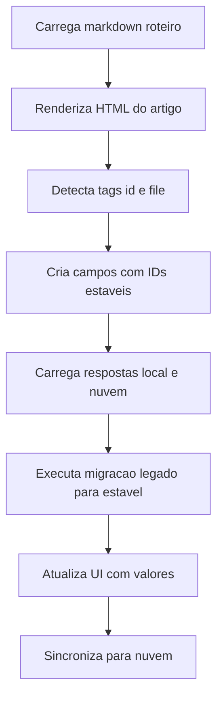
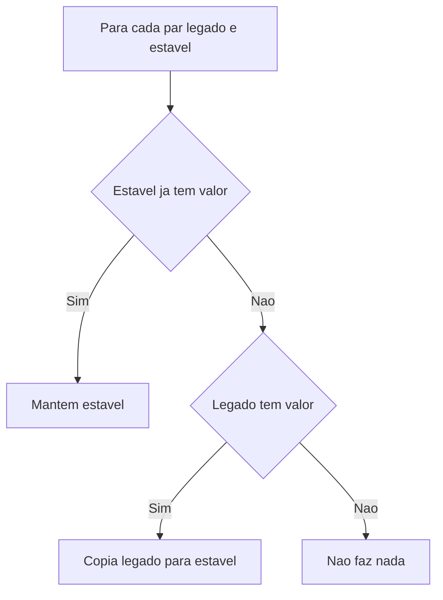

# [PLAN] IDs Estáveis no Formulário de Investigação (Estratégia 1)

## Análise de Contexto

Hoje o formulário é gerado a partir do Markdown `Refined/roteiro-investigacao-unidades.md`.

- Campos de tabela recebem IDs posicionais como `table_${tIndex}_row_${rIndex}_col_${cIndex}`.
- Perguntas em listas recebem IDs posicionais como `question_${index}`.
- As respostas são persistidas por `field_id` (chave) em:
  - `localStorage` em `investigation_form_data`.
  - Nuvem via `POST /api/sync-submissions` (JSONB em `submissions.answers` e linhas na tabela `answers`).
  - Anexos via `field_id` em `attachments` e referência `_blob` no `answers`.

Problema: qualquer mudança estrutural no Markdown (reordenação, remoção de linhas de tabela, conversão tabela -> pergunta) muda `tIndex/rIndex/cIndex` e/ou o `question_${index}`. Isso faz a UI parar de “enxergar” respostas já existentes. Você precisa **zero perda** em:

- Nuvem.
- `localStorage`.
- Exportações e visualizações existentes.

Objetivo: permitir refatorar tabelas complexas em perguntas específicas com campos e anexos próprios, **sem perder nenhum dado já coletado**.

---

## Estratégia Técnica

### Visão geral

1. Introduzir **IDs estáveis explícitos** no Markdown, para inputs e uploads, de forma que o `field_id` não dependa de posição.
2. Implementar uma camada de **migração e alias** que copia/espelha automaticamente valores legados (`table_*`, `question_*`) para os novos IDs estáveis.
3. Manter compatibilidade retroativa com:
   - `localStorage` antigo.
   - Respostas já salvas no banco.
   - Anexos já salvos (mesmo blob, novo `field_id`).
4. Só depois, iniciar a refatoração do `Refined/roteiro-investigacao-unidades.md` (tabela -> perguntas).

### Padrão de marcação no Markdown (escolha do usuário)

Usar tag explícita no texto do Markdown:

- Para um campo (resposta): `[[id: due_a1_headcount_total_cajamar]]`
- Para um anexo: `[[file: due_a1_headcount_total_cajamar_file]]`

Regras:

- IDs são estáveis, sem espaços, com `_`.
- IDs devem ser únicos no documento.
- Para anexos, usar sufixo `_file` e armazenar `_blob` automaticamente, como hoje.

### Renderização: como a UI vai usar IDs estáveis

Modificar o pipeline de `renderInvestigationForm` para:

- Detectar as tags `[[id: ...]]` e `[[file: ...]]`.
- Remover a tag do texto visível.
- Criar input/textarea/file input com o `id` definido explicitamente.

Observação: a primeira versão pode continuar sendo:

- Campo texto para respostas.
- Upload simples para evidências.

(Os tipos de campo podem evoluir depois, sem quebrar IDs.)

### Migração automática (zero perda)

A migração deve funcionar em 3 cenários:

- Usuário já tem dados no `localStorage`.
- Usuário já tem dados na nuvem.
- Usuário tem ambos (sincronização bidirecional já existe).

Mecânica de migração:

1. Criar um “mapa de migração” (legado -> novo) versionado no código.
2. Na carga do formulário (após `renderInvestigationForm` e antes de `loadFormAnswers` final), executar:

- Para cada par `oldId -> newId`:
  - Se `newId` está vazio e `oldId` tem valor, copiar valor para `newId`.
  - Para anexos:
    - Se existir `oldId_blob`, copiar para `newId_blob`.
    - Se existir `oldId` (nome do arquivo), copiar para `newId`.
3. Persistir imediatamente em `localStorage` (sem apagar o legado).
4. Agendar `syncToCloud` para gravar também na nuvem.

Compatibilidade extra:

- Não deletar chaves antigas automaticamente.
- O export e o dashboard continuam funcionando porque a base antiga segue existindo.
- Gradualmente, export e dashboard podem ser atualizados para usar IDs novos (ou ambos).

### Estratégia para anexos (escolha do usuário)

Anexos serão migrados automaticamente:

- `old_field_file` e `old_field_file_blob` serão copiados para `new_field_file` e `new_field_file_blob`.
- O blob não é duplicado. O novo campo apenas aponta para o mesmo blob.

### Zero-Risk Parallel Development (toggle)

Adicionar flag de configuração (feature toggle) para ligar/desligar:

- `STABLE_FIELD_IDS_ENABLED` (default: desligado até validar).
- `LEGACY_TO_STABLE_MIGRATION_ENABLED` (default: ligado quando o primeiro for ligado).

Isso permite rollback instantâneo sem perder dados.

### Backups e validação

Antes de qualquer mudança estrutural no Markdown:

- Exportar `localStorage['investigation_form_data']`.
- Exportar o JSON do submission da nuvem.
- Teste de smoke:
  - Abrir o formulário.
  - Verificar que valores aparecem.
  - Verificar anexos com ✅ e link de download.

---

## UI/UX

### Situação atual (simplificada)

```
[ Roteiro de Investigação ]

Tabela A
  Dado | Cajamar | GRU FOOD | GRU FM
  ...  |  input  |  input   | input

Perguntas:
  1. ... [textarea] [upload]
  2. ...
```

### Com IDs estáveis (mesma UI, base sólida)

```
[ Roteiro de Investigação ]

Tabela Resumo (só KPIs simples)
  Dado | Cajamar | GRU FOOD | GRU FM
  ...  |  input  |  input   | input

Perguntas de Coleta (IDs estáveis)
  A1. Quantidade por cargo  [textarea ou input]  [upload]
  A2. Salário por cargo     [textarea ou input]  [upload]
```

### Indicadores úteis (não obrigatórios na fase 1)

- Mostrar “Migrado do legado” em um texto discreto quando um campo novo foi preenchido via migração.
- Mostrar “Existe anexo legado” quando o blob foi migrado.

---

## Fluxos (Mermaid)

### Fluxo de renderização e migração



### Fluxo de decisão de migração por campo



---

## Riscos e Mitigações

- **Risco: colisão de IDs estáveis**
  - Mitigação: validação em runtime, logar erro e não renderizar campo duplicado.

- **Risco: migração sobrescrever dado novo**
  - Mitigação: copiar somente quando `newId` estiver vazio.

- **Risco: anexos migrarem sem `_blob`**
  - Mitigação: tratar separadamente `field` e `field_blob`. Se não houver blob, manter apenas nome.

- **Risco: dashboard e export ficarem inconsistentes**
  - Mitigação: manter legado intacto. Export pode ser atualizado para preferir estáveis quando existirem.

- **Risco: rollback**
  - Mitigação: feature toggle. Dados novos continuam salvos. UI volta a renderizar legado sem apagar nada.

---

## Entregáveis

- Suporte a tags `[[id: ...]]` e `[[file: ...]]` no `renderInvestigationForm`.
- Mapa de migração (legado -> estável) para o `roteiro-investigacao-unidades.md`.
- Função de migração idempotente.
- Smoke tests manuais com backup.

---

## Critérios de Aceite

- Nenhuma resposta desaparece após a mudança.
- Campos novos aparecem preenchidos quando houver dado legado correspondente.
- Anexos antigos continuam com download funcional e são visíveis nos campos novos.
- Sincronização para nuvem continua operando.
- Toggle permite desligar IDs estáveis e voltar para o comportamento anterior sem perda.
