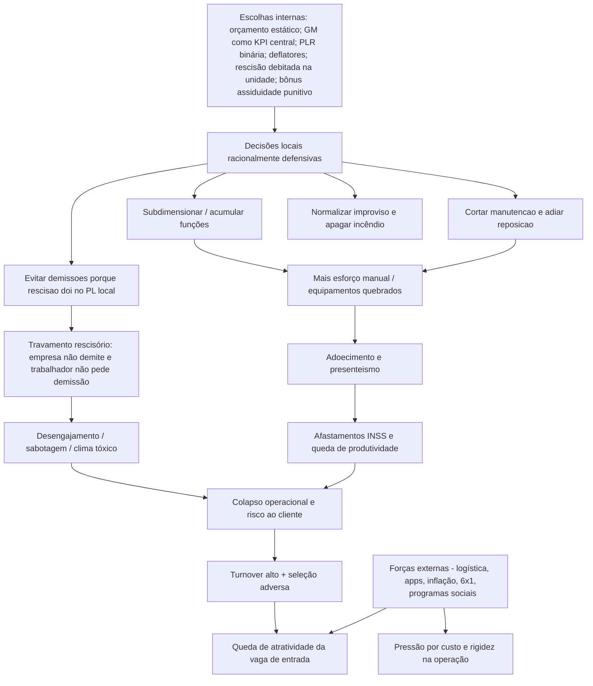
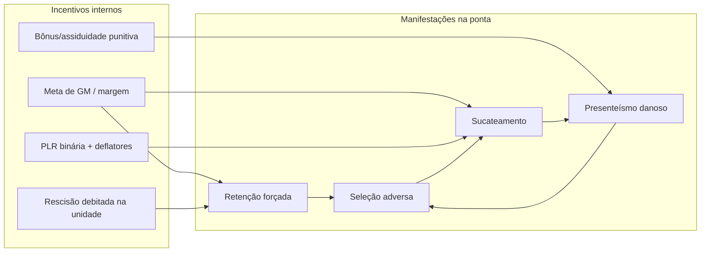

# Overview — Relatório de Investigação Qualitativa sobre Turnover no Frontline (Sodexo)

## Como ler este overview (e como interpretar “páginas”)

Este repositório contém o relatório em formato de **artigos Markdown navegáveis** (Single Page App). Não há um PDF versionado aqui; portanto, quando este documento menciona **“página”**, está se referindo à **seção/capítulo** identificada pelo **ID do relatório** (o hash `#XX` usado na navegação).

- **Página #00** = `Mapa de Conteúdo` (visão geral e navegação)
- **Página #06** = `Resumo Executivo (Board)`
- **Página #11** = `Visão Sistêmica do Turnover (os ciclos)`
- **Página #05** = `Dossiês Operacionais (evidências de campo)`
- **Página #01** = `Arquitetura de Incentivos (margem vs sustentabilidade)`
- **Página #02** = `Riscos Psicossociais (custo humano)`
- **Página #03** = `Travamento Rescisório (gestão de pessoas)`
- **Página #04** = `Panorama Macroeconômico (forças externas vs escolhas internas)`
- **Página #07** = `Painel de Risco Consolidado`
- **Página #08** = `Plano de Intervenção Estratégica (intervenções I-XX)`
- **Página #12** = `Perguntas Frequentes (Q&A)`
- **Página #13** = `Nota de ROI (memo executivo)`
- **Página #09** = `Contexto Histórico (2023–2026)`
- **Página #10** = `Catálogo de Experimentos (CoP 2024)`
- **Página #15** = `Roteiro de Investigação (campo e coleta)`

> Importante: o relatório foi construído para responder rapidamente “o que está acontecendo / por que continua / quanto custa / o que fazer”. O documento “autoridade” de navegação é a **Página #00**.

---

## O que é este relatório (em uma frase)

Este relatório é uma **investigação qualitativa de campo** sobre o turnover no frontline da Sodexo (≈46 mil pessoas; ≈40% ao ano), tratando o turnover não como um “problema de RH”, mas como um **fenômeno sistêmico** produzido pela interação entre:

- **Forças externas do mercado de trabalho** (logística, apps, inflação, 6x1)
- **Escolhas internas** (arquitetura de incentivos financeiros, orçamento, PLR, bônus de assiduidade)
- **Efeitos operacionais e humanos** (sobrecarga, adoecimento, queda de produtividade, risco jurídico)

O objetivo final não é “explicar pessoas”, e sim **auditar regras** e propor um **plano de intervenção** que quebre ciclos viciosos com governança, priorização e uma lógica de execução.

---

## Tese central (o núcleo do argumento)

A tese central está explicitada na **Página #00** e sustentada ao longo do relatório:

- A Sodexo está maximizando indicadores de curto prazo (especialmente **GM/margem**) de uma maneira que produz **passivos ocultos**.
- Esses passivos se materializam como:
  - riscos trabalhistas (desvio de função, insalubridade, ações coletivas)
  - colapsos operacionais (atrasos, falhas de entrega, improviso crônico)
  - adoecimento (físico e mental) e presenteísmo
  - deterioração de marca empregadora e perda de atratividade
- O turnover é, em grande parte, uma **saída racional** do sistema (para quem pode sair) e uma **retenção forçada** (para quem não pode).

A explicação “por que as pessoas saem?” é insuficiente. A pergunta correta é:

- **Quais incentivos tornam racional trabalhar doente, forçar demissão, cortar manutenção, operar com subdimensionamento e normalizar improviso?**

Referências principais:
- **Página #00** (Tese Central)
- **Página #01** (Arquitetura de incentivos e passivos ocultos)
- **Página #11** (Ciclos sistêmicos)
- **Página #06** (Resumo executivo, em linguagem de decisão)

---

## Campo e escopo da investigação (o “onde” e o “como”) — evidências que ancoram a tese

O relatório se baseia em estudo de campo com entrevistas (Dezembro/2025) e análise comparativa de unidades que funcionam como **arquétipos** do problema.

Unidades investigadas e por que elas importam:

- **Cajamar (Food) — Leroy Merlin**
  - Aparece como caso de **trauma organizacional**, clima de “guerra/sabotagem”, infraestrutura precária, instabilidade crônica de liderança.
  - Evidencia como o sistema pode degradar o “contrato social” com o frontline.
  - Referência: **Página #05**.

- **Guarulhos (Food) — União Química**
  - Caso de “liderança estável porém impotente” e **explosão de volume** sem ajuste de estrutura (subdimensionamento real).
  - Evidencia o custo humano concentrado nos veteranos (“velha guarda”).
  - Referência: **Página #05**.

- **Guarulhos (FM / Limpeza Industrial) — União Química**
  - Caso de porta giratória, falta de EPI/insumos, penalização severa por ausência (bônus/assiduidade), medicalização.
  - Evidencia exposição jurídica e risco reputacional/contratual.
  - Referência: **Página #05**.

O relatório enfatiza que as falhas observadas **não são “gestão local ruim”**, mas sintomas previsíveis do mesmo desenho de incentivos.

---

## Mapa do raciocínio: do ambiente externo ao turnover

Abaixo, um mapa de causalidade (alto nível) que resume como o relatório constrói o argumento.

Onde cada bloco é aprofundado:
- **Forças externas vs escolhas internas:** **Página #04**
- **Escolhas internas e incentivos:** **Página #01**
- **Adoecimento e presenteísmo:** **Página #02**
- **Travamento rescisório:** **Página #03**
- **Ciclos (dinâmica de retroalimentação):** **Página #11**
- **Evidências concretas (campo):** **Página #05**

---

## Os 4 ciclos sistêmicos (como o turnover se perpetua)

A **Página #11** descreve quatro ciclos de retroalimentação. Eles não são “quatro problemas”; são quatro maneiras do mesmo sistema se manifestar.

1. **Ciclo da Retenção Forçada**
   - `Meta GM → Bloqueio de demissões → Funcionário retido → Baixa produtividade → Custos sobem → (reinicia)`
   - Conecta diretamente com o **Travamento Rescisório**.
   - Referências: **Página #11** e **Página #03**.

2. **Ciclo do Presenteísmo Danoso**
   - `Bônus assiduidade → Trabalhar doente → Agrava lesão → Aumenta faltas → Sobrecarrega colegas → (reinicia)`
   - É um ciclo “enganosamente eficiente”: reduz falta formal no curto prazo e explode custo no médio prazo.
   - Referências: **Página #11** e **Página #02**.

3. **Ciclo do Sucateamento da Infraestrutura**
   - `Corte de manutenção → Equipamentos quebrados → Esforço manual → Lesões → Afastamento → (reinicia)`
   - Central para entender por que a operação “consome corpos” como variável de ajuste.
   - Referências: **Página #11**, **Página #01**, **Página #05**.

4. **Ciclo da Seleção Adversa**
   - `Condições precárias → Perda de atratividade → Contratação emergencial → Sobrecarga de veteranos → (reinicia)`
   - Explica por que “contratar mais” sem mexer no sistema pode falhar.
   - Referências: **Página #11**, **Página #04**, **Página #05**.

Resumo visual dos ciclos e seus gatilhos:

---

## O “núcleo contábil” do problema: passivos ocultos e economia aparente

A **Página #01** traduz achados qualitativos em linguagem de risco financeiro.

- **Economia aparente**: decisões que protegem a margem do mês.
- **Passivo oculto**: custo que aparece depois (jurídico, INSS, retrabalho, perda de contrato, reputação).

A síntese do relatório é que a margem reportada **não captura**:

- produtividade perdida por retenção forçada
- custo de afastamentos prolongados (INSS) impulsionados por presenteísmo
- exposição acumulada por desvio de função (potencial ação coletiva)
- custo real do turnover (recrutamento, treinamento, queda de qualidade)
- risco contratual com clientes estratégicos

Referência: **Página #01** e seu quadro “Mecanismo → Passivo oculto”.

---

## Custo humano: o relatório descreve um ambiente produtor de adoecimento

A **Página #02** organiza o “custo humano” em dois eixos:

- **Custo físico**
  - cadeia causal: restrição orçamentária → subdimensionamento → esforço manual por falha de máquina → lesões → cronificação → ciclo fecha pela punição ao atestado.

- **Custo mental**
  - ansiedade crônica na base (pressão, improviso, desvalorização)
  - sofrimento ético e esgotamento da liderança (GU “sanduíche”)
  - uso transversal de medicação controlada como sintoma sistêmico (não individual)

O relatório insiste num ponto metodológico: quando a mesma forma de sofrimento aparece em múltiplas unidades e perfis, **a hipótese forte é de causa estrutural**.

Referência: **Página #02**.

---

## Travamento Rescisório: por que o sistema “prende” empresa e trabalhador

A **Página #03** descreve o travamento como um impasse de incentivos:

- A empresa evita demitir porque:
  - rescisão sai do resultado local
  - aumenta rotatividade (deflator de bônus)

- O trabalhador evita pedir demissão porque:
  - pedir demissão abre mão de direitos (FGTS/multa/sd)
  - para baixa renda, a rescisão é uma forma de capitalização

O resultado é um “equilíbrio ruim” (descrito como equilíbrio negativo) onde:

- ficam colaboradores que não querem ficar
- saem os que podem sair
- cresce o desengajamento e o custo invisível

Referências:
- **Página #03** (mecanismo, fases e consequências)
- **Página #01** (como o incentivo é desenhado)
- **Página #04** (o FGTS como força estrutural externa)

---

## Panorama macroeconômico: o que é “pressão externa” e o que é “escolha interna”

A **Página #04** é o “antídoto” contra uma explicação fatalista do turnover.

O relatório reconhece forças externas reais:

- competição com logística e apps
- inflação de insumos
- desgaste social/político da escala 6x1
- programas sociais elevando o “piso de aceitação”

Mas argumenta que o externo **não determina** o interno. Ele apenas muda o tabuleiro.

O ponto de decisão é: **num mercado hostil, a empresa pode escolher competir por custo (precarizando) ou por dignidade/operabilidade (investindo no básico).**

Referência: **Página #04**.

---

## Painel de risco: como o relatório prioriza ameaças (jurídico, operacional, contratual)

A **Página #07** consolida riscos por probabilidade/impacto e conecta cada risco a intervenções.

Riscos destacados:

- **Ação coletiva por desvio de função** (crítico)
- **Afastamentos INSS em massa** (alto)
- **Perda de contratos estratégicos (União Química / Leroy Merlin)** (alto)
- **Fiscalização MTE e NRs (EPI/ergonomia)** (alto)

Esse painel é importante porque traduz “turnover” em **risco executivo**: um problema que pode virar multa, ação coletiva, perda de contrato e choque reputacional.

Referência: **Página #07**.

---

## Resumo Executivo (para decisão): as perguntas que o board faz

A **Página #06** organiza o relatório em um formato decisório:

- **Cenário:** por que não contrata/retém
- **Causalidade:** por que continua acontecendo
- **Financeiro:** se economiza ou perde dinheiro
- **Solução:** como quebrar o ciclo

Ela também define o recorte das unidades como “arquétipos” e já aponta o encadeamento:

- macroeconomia hostil (**Página #04**)
- incentivos e passivos (**Página #01**)
- riscos psicossociais (**Página #02**)
- travamento rescisório (**Página #03**)
- lógica circular dos ciclos (**Página #11**)
- plano consolidado (**Página #08**)

Referência: **Página #06**.

---

## Plano de Intervenção: o que o relatório recomenda fazer (e em que ordem)

A **Página #08** é o coração prescritivo: ela transforma diagnóstico em um **conjunto de intervenções** (`I-01`, `I-02`, …) organizadas em **4 frentes** (com uma lógica de precedência, mas que pode sobrepor).

### Frente 1 — TORNIQUETE (imediato & dignidade)
Objetivo: parar a sangria; reduzir risco legal/sanitário; restaurar o básico.

Exemplos (referência **Página #08**):
- `I-01` compra centralizada de uniformes/EPI
- `I-02` desvincular cesta/benefício de atestados
- `I-03` mesa com cliente para infraestrutura

### Frente 2 — DESCOMPRESSÃO (curto prazo & clima)
Objetivo: reduzir conflito e sensação de injustiça; criar rituais e mecanismos de organização.

Exemplos:
- `I-07` rodízio de tarefas pesadas com visualização
- `I-12` canal mensal de escuta
- `I-29` protocolo de passagem de turno

### Frente 3 — REESTRUTURAÇÃO (médio prazo & regras do jogo)
Objetivo: mexer na arquitetura de incentivos que produz os ciclos.

Exemplos:
- `I-14` fundo corporativo para rescisões (renovação)
- `I-16` revisão de quadro por demanda real (base zero)
- `I-17` orçamento protegido para manutenção essencial
- `I-22` gatilho progressivo de PLR (anti “tudo ou nada”)
- `I-23` desconto proporcional para faltas (anti punição binária)

### Frente 4 — REPOSICIONAMENTO (longo prazo & mercado)
Objetivo: competir com o mercado atual; tornar a vaga atrativa.

Exemplos:
- `I-24` fretado e escalas competitivas
- `I-25` pacote de benefícios (saúde + VR)
- `I-27` ajuste salarial territorial

Referência: **Página #08**.

---

## Por que o relatório insiste em “mudar regra” em vez de “trocar gestor”

A **Página #12 (Perguntas Frequentes)** reforça a hipótese de desenho:

- O gestor local está frequentemente fazendo “conta de sobrevivência orçamentária”.
- Trocar gestor sem mudar as regras tende a reproduzir o mesmo resultado.

Também antecipa objeções comuns:

- “A amostra é pequena” → pequena para julgar pessoas, robusta para auditar regras.
- “O fundo de rescisão vira farra” → risco moral existe e deve ser mitigado com governança e critérios.
- “O problema é comercial” → contratos ruins existem, mas passivo e turnover destroem valor mesmo em contratos bons.

Referência: **Página #12**.

---

## Memória do projeto: por que este relatório existe (2023–2026)

A **Página #09** mostra a evolução da compreensão:

- 2023: sensemaking executivo (turnover como risco sistêmico)
- 2024: Ipatinga + CoP → evidência de que voluntarismo não escala; sistema “repele” mudanças
- 2025: mergulho em Cajamar/Guarulhos → arquitetura de incentivos como mecanismo central
- 2026: plano de intervenção em 4 frentes

A **Página #10** é a “base de evidências” do porquê abordagens comportamentais/voluntárias falham sem mexer no incentivo.

Referências: **Página #09** e **Página #10**.

---

## Nota de ROI: como defender o investimento (e o aprendizado) para executivos

A **Página #13** responde à pergunta: “valeu a pena investir nisso?”

- O valor não está em achar “uma causa raiz única” (não existe), e sim em mapear o sistema.
- A CoP mostrou um fato decisivo: **mudanças voluntárias perdem para a rotina e para o incentivo.**
- O plano, então, muda o tipo de intervenção: de campanhas/treinamentos para regras.

Referência: **Página #13**.

---

## Como usar este relatório em novas conversas (guia para LLM / leitor)

Se você (ou um LLM) precisar “reconstruir rapidamente” o sentido do relatório, use este roteiro:

1. **Entenda a tese e a navegação**
   - Leia **Página #00**.

2. **Consiga o resumo para decisão**
   - Leia **Página #06**.

3. **Veja as evidências de campo**
   - Leia **Página #05**.

4. **Entenda por que isso não é só macroeconomia**
   - Leia **Página #04**.

5. **Entenda o mecanismo interno (incentivo → passivo)**
   - Leia **Página #01**.

6. **Entenda a dinâmica (ciclos)**
   - Leia **Página #11**.

7. **Aprofunde os mecanismos humanos e de people**
   - Leia **Página #02** e **Página #03**.

8. **Saiba como priorizar riscos**
   - Leia **Página #07**.

9. **Vá para prescrição e execução**
   - Leia **Página #08**.

10. **Prepare respostas para objeções típicas**
   - Leia **Página #12**.

---

## Glossário curto (termos do relatório)

- **Frontline**: força operacional na ponta (cozinha, limpeza, etc.).
- **GU**: Gerente de Unidade (liderança local).
- **GO/GCE**: níveis acima (gestão de portfólio/contas), que repassam pressão e negociam com cliente.
- **GM (Gross Margin)**: margem bruta; KPI central.
- **PLR**: remuneração variável, com “gatilho binário” e deflatores.
- **Deflator**: regra que reduz bônus por ocorrências (rotatividade, acidentes, etc.).
- **Travamento Rescisório**: impasse estrutural empresa-trabalhador causado por rescisão no P&L local e FGTS.
- **Presenteísmo**: trabalhar doente para evitar punição/perda de renda.
- **Seleção adversa**: piora do perfil de entrada porque a vaga perde atratividade.
- **Passivo oculto**: custo futuro não refletido na margem do mês.

---

## Observação final

Este relatório foi desenhado para sustentar um argumento simples e duro:

- **o problema é sistêmico**
- **o custo real está escondido**
- **a solução precisa mexer nas regras, não apenas nas pessoas**

Referência geral para essa síntese: **Página #06**, **Página #01**, **Página #11**, **Página #08**.
