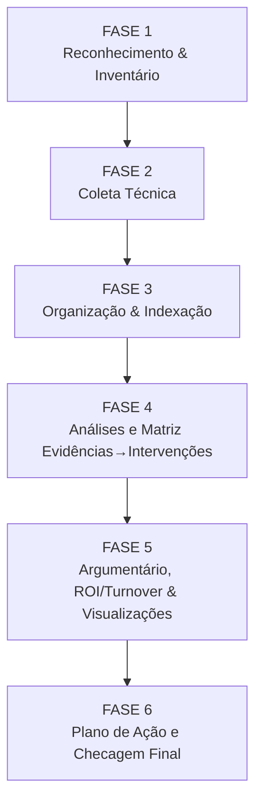
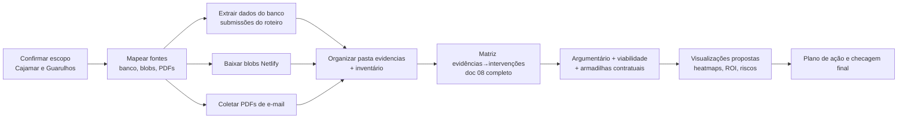

# Plano Detalhado — Consolidação de Evidências e Fundamentação das Intervenções (Cajamar e Guarulhos)

Escopo confirmado: **Cajamar** e **Guarulhos** (Food + FM). Entregáveis-chave em Markdown na raiz, matriz evidências→intervenções (doc 08 completo), análise contratual, argumentário/viabilidade, plano de investigação e sugestões de visualização.

## Visão Geral das Fases

## Checklist por Fase (cronológico)

### FASE 1 — Reconhecimento & Inventário (contexto e fontes)
- [x] Ler/confirmar **doc 08** (todas as intervenções I-XX) e IDs atualizados.
- [x] Mapear fontes de dados existentes no repo:
  - [x] Respostas já presentes (se houver dumps ou exportações).
  - [x] PDFs/anexos já no projeto (nenhum adicional além dos blobs baixados).
- [x] Identificar credenciais/rotas para:
  - [x] **Banco** (Postgres Netlify/Neon) — tabela de submissões do Roteiro.
  - [x] **Blobs Netlify** — uploads de evidências (fotos/PDFs/etc.).
- [x] Definir convenção de nomenclatura de arquivos e pastas.

Observação: Acesso confirmado ao site correto (`relatoriosdx`) e store `evidence-files`; intervenções de doc 08 lidas e alinhadas.

### FASE 2 — Coleta Técnica (dados primários)
- [x] Extrair respostas do formulário no **banco** (ajustado para `unit_slug=general`; 3 submissions, 6 attachments).
- [x] Listar e baixar **blobs** do Netlify (todos os 6 blobs baixados do site `relatoriosdx`).
- [x] Coletar **PDFs/anexos** enviados por e-mail (aguardando usuário inserir em `evidencias/pdfs/`).

Observação: Export gerado em `evidencias/banco/` (inclui `submissions_normalized.json`); blobs baixados em `evidencias/blobs/`. PDFs seguem pendentes de input manual.

### FASE 3 — Organização & Indexação (pasta de evidências)
- [x] Criar pasta raiz de evidências (ex.: `/evidencias/`).
- [x] Subpastas sugeridas:
  - [x] `/evidencias/banco/` (export do formulário)
  - [x] `/evidencias/blobs/` (downloads Netlify)
  - [x] `/evidencias/pdfs/` (anexos de e-mail)
  - [x] `/evidencias/indice/` (inventário em Markdown)
- [x] Criar **inventário Markdown** listando: nome do arquivo, origem (banco/blob/email), data, unidade (Cajamar/Guarulhos), intervenção(ões) potencial(ais).

Observação: Inventários atualizados (`inventario-banco.md`, `inventario-geral.md`). Export normalizado (`submissions_normalized.json`) pronto para uso na matriz.

### FASE 3.1 — Análise de Inventário e Map of Content (MoC)
- [ ] Inspecionar cada arquivo já listado no inventário (banco/blobs/pdfs).
- [ ] Criar **Map of Content (MoC)** por fonte (banco, blobs, pdfs), listando arquivos e breve resumo.
- [ ] Extrair pontos-chave por arquivo, conectando explicitamente às perguntas/intervenções que o conteúdo ajuda a responder.
- [ ] Registrar notas/achados em Markdown (p.ex.: `evidencias/indice/moc.md` e/ou notas por arquivo) para alimentar a FASE 4.

Observação: esta fase prepara a matriz (FASE 4) consolidando resumos e ligações arquivo→perguntas/intervenções. PDFs entram quando o usuário os adicionar.

### FASE 4 — Análises e Matriz Evidências→Intervenções (doc 08)
- [ ] Para **cada intervenção** de doc 08 (I-01 ... I-35 conforme numeração vigente no arquivo):
  - [ ] Registrar tensões/objetivos/impactos do doc 08.
  - [ ] Vincular evidências (respostas banco, PDFs, blobs) que suportam a intervenção.
  - [ ] Marcar lacunas de dado (o que falta para suportar ROI/viabilidade).
- [ ] Produzir **Matriz em Markdown** (por I-XX):
  - ID, Nome, Tensão, Evidências, Lacunas, Métricas possíveis (ROI/turnover), Riscos/Pré-condições.

Observação: Pronto para iniciar. Base de dados a usar: `submissions_normalized.json` + blobs baixados; PDFs aguardam input do usuário.

### FASE 5 — Argumentário, ROI/Turnover & Visualizações
- [ ] Argumentário por intervenção:
  - [ ] “O que os dados provam” vs “o que sugerem” vs “o que falta validar”.
  - [ ] Viabilidade prática (travas contratuais, orçamento, equipe).
- [ ] Análise de **armadilhas contratuais** (Cajamar, Guarulhos Food, Guarulhos FM):
  - [ ] Identificar cláusulas que empurram custo de infra/manutenção para Sodexo.
  - [ ] Mapear incentivo perverso (ex.: sucateamento → esforço manual → adoecimento → turnover).
  - [ ] Sinalizar necessidade de renegociação/adição contratual.
- [ ] Sugerir visualizações (Markdown + especificação):
  - [ ] Mapa intervenção ↔ evidências ↔ impacto esperado.
  - [ ] Heatmap de risco (jurídico/INSS/contrato/turnover) por unidade.
  - [ ] Estimativas de custo evitado (INSS, turnover, passivo) por intervenção/unidade.
  - [ ] Viabilidade de execução (semáforo) por intervenção.

### FASE 6 — Plano de Ação e Checagem Final
- [ ] Consolidar tudo em Markdown na raiz (entregáveis finais):
  - [ ] Matriz Evidências→Intervenções.
  - [ ] Inventário de evidências.
  - [ ] Argumentário/viabilidade e análise contratual.
  - [ ] Plano de investigação (roteiro) para fechar lacunas.
- [ ] Revisar consistência de IDs (intervenções renumeradas) com doc 08.
- [ ] Checklist de completude: Cajamar e Guarulhos cobertos; blobs e PDFs processados; lacunas explicitadas.

## Fluxo Operacional (Mermaid)

## Notas e Decisões Já Respondidas
- Unidades: **Cajamar e Guarulhos** (Food + FM).
- Formato da matriz: **Markdown**.
- Intervenções: **todas do doc 08** (usar numeração vigente no arquivo, após renumeração manual feita pelo usuário).
- Banco: necessário verificar na execução qual o schema/tabela de submissões e se há “unit slug” ou modo “general”.

## Próximos Passos Imediatos (sem executar ainda)
- [ ] Validar convenção de pastas/nomes a usar.
- [ ] Confirmar acesso/credenciais ao banco e aos blobs Netlify.
- [ ] Decidir nomes dos arquivos finais em Markdown na raiz (ex.: `matriz-intervencoes.md`, `inventario-evidencias.md`, `argumentario-viabilidade.md`, `plano-investigacao.md`).
