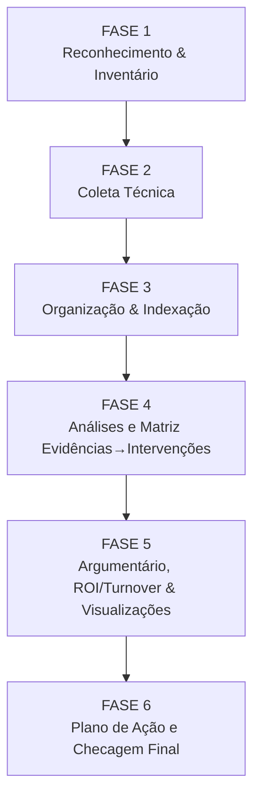
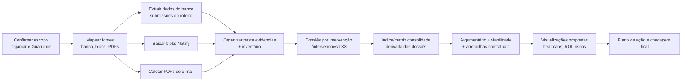

# Plano Detalhado — Consolidação de Evidências e Fundamentação das Intervenções (Cajamar e Guarulhos)

Escopo confirmado: **Cajamar** e **Guarulhos** (Food + FM). Entregáveis-chave em Markdown na raiz, matriz evidências→intervenções (doc 08 completo), análise contratual, argumentário/viabilidade, plano de investigação e sugestões de visualização.

## Visão Geral das Fases

```mermaid
flowchart TD
  F1[FASE 1\nReconhecimento & Inventário] --> F2[FASE 2\nColeta Técnica]
  F2 --> F3[FASE 3\nOrganização & Indexação]
  F3 --> F4[FASE 4\nAnálises e Matriz Evidências→Intervenções]
  F4 --> F5[FASE 5\nArgumentário, ROI/Turnover & Visualizações]
  F5 --> F6[FASE 6\nPlano de Ação e Checagem Final]
```

## Checklist por Fase (cronológico)

### FASE 1 — Reconhecimento & Inventário (contexto e fontes)
- [x] Ler/confirmar **doc 08** (todas as intervenções I-XX) e IDs atualizados.
- [x] Mapear fontes de dados existentes no repo:
  - [x] Respostas já presentes (se houver dumps ou exportações).
  - [x] PDFs/anexos já no projeto (nenhum adicional além dos blobs baixados).
- [x] Identificar credenciais/rotas para:
  - [x] **Banco** (Postgres Netlify/Neon) — tabela de submissões do Roteiro.
  - [x] **Blobs Netlify** — uploads de evidências (fotos/PDFs/etc.).
- [x] Definir convenção de nomenclatura de arquivos e pastas.

Observação: Acesso confirmado ao site correto (`relatoriosdx`) e store `evidence-files`; intervenções de doc 08 lidas e alinhadas.

### FASE 2 — Coleta Técnica (dados primários)
- [x] Extrair respostas do formulário no **banco** (ajustado para `unit_slug=general`; 3 submissions, 6 attachments).
- [x] Listar e baixar **blobs** do Netlify (todos os 6 blobs baixados do site `relatoriosdx`).
- [x] Coletar **PDFs/anexos** enviados por e-mail (inseridos em `evidencias/pdfs/`).

Observação: Export gerado em `evidencias/banco/` (inclui `submissions_normalized.json`); blobs baixados em `evidencias/blobs/`. PDFs inseridos em `evidencias/pdfs/` e processados (OCR + extração de texto).

### FASE 3 — Organização & Indexação (pasta de evidências)
- [x] Criar pasta raiz de evidências (ex.: `/evidencias/`).
- [x] Subpastas sugeridas:
  - [x] `/evidencias/banco/` (export do formulário)
  - [x] `/evidencias/blobs/` (downloads Netlify)
  - [x] `/evidencias/pdfs/` (anexos de e-mail)
  - [x] `/evidencias/indice/` (inventário em Markdown)
- [x] Criar **inventário Markdown** listando: nome do arquivo, origem (banco/blob/email), data, unidade (Cajamar/Guarulhos), intervenção(ões) potencial(ais).

Observação: Inventários atualizados (`inventario-banco.md`, `inventario-geral.md`). Export normalizado (`submissions_normalized.json`) pronto para uso na matriz.

### FASE 3.1 — Análise de Inventário e Map of Content (MoC)
- [x] Inspecionar cada arquivo já listado no inventário (banco/pdfs) e mapear blobs por `attachments.json`.
- [x] Criar **Map of Content (MoC)** por fonte (banco, blobs, pdfs), listando arquivos e breve resumo.
- [x] Extrair pontos-chave por arquivo, conectando explicitamente às perguntas/intervenções que o conteúdo ajuda a responder.
- [x] Registrar notas/achados em Markdown (p.ex.: `evidencias/indice/moc.md` e/ou notas por arquivo) para alimentar a FASE 4.
- [x] Ler detalhadamente os **Blobs** (ZIP/XLSX/PDF) e produzir resumos com base em conteúdo (não apenas nome/escopo).

Observação: MoC consolidada em `evidencias/indice/moc.md`, com PDFs processados via OCR quando necessário e resumos com números/datas/cláusulas quando extraíveis. Blobs lidos com base em saídas derivadas (XLSX→CSV) e extração estruturada de PDFs de descrição de cargo via Gemini.

### FASE 3.2 — Digestão Analítica das Evidências (análise crítica + “base de conhecimento”)
- [ ] Produzir uma **nota analítica por evidência-chave** (banco, PDF, blob), com rastreabilidade completa e leitura crítica.
- [ ] Para cada nota analítica:
  - [ ] Extrair **claims falsificáveis** (o que o documento permite afirmar) vs **hipóteses** vs **lacunas**.
  - [ ] Conectar explicitamente aos elementos do relatório:
    - [ ] **Ciclos** (Página #11)
    - [ ] **Riscos** (Página #07)
    - [ ] **Intervenções** (Página #08; I-XX)
    - [ ] Quando aplicável: **incentivos/PLR/GM** (Página #01) e **travamento rescisório** (Página #03)
- [ ] Criar MoCs/índices complementares **por tema** (além de “por fonte”) para acelerar a FASE 4 (ex.: `PLR`, `Contratos`, `Rescisão`, `SAP/Orçamento/Manutenção`, `Quadro e salários`).
- [ ] Consolidar uma lista curta de “evidências-mãe” (as que suportam múltiplas intervenções) e priorizá-las para leitura profunda.
- [ ] Fazer **cross-check das lacunas**: para cada lacuna registrada nas notas, verificar se ela já foi respondida por:
  - [ ] outras respostas do formulário (banco), incluindo tabelas derivadas (`evidencias/indice/tabelas/<submission_id>/...`)
  - [ ] PDFs (e-mail) e seus textos extraídos
  - [ ] blobs e saídas derivadas (CSV/JSON)
  - [ ] inventários (`inventario-*.md`) e MoC (`moc.md`)
  - [ ] se encontrada resposta, promover de “lacuna” para “claim” com referência explícita (path + contexto/ID)

 Critério de pronto (Definition of Done) para avançar para a FASE 4:
 - [ ] Para os temas centrais (PLR; contratos/break-even; rescisão; quadro/custos), existir pelo menos:
   - [ ] 1 nota analítica por documento “mãe” (com claims + ligações I-XX)
   - [ ] 1 lista de lacunas acionáveis (o que falta e como coletar)
   - [ ] 1 mapa de ligação “tema → evidências → intervenções” pronto para ser colado nos dossiês
   - [ ] cross-check executado: lacunas revisadas contra o inventário completo (promover o que já está respondido)

### FASE 4 — Análises e Dossiês por Intervenção
- [x] Criar pasta `./intervencoes/` (raiz do projeto) para conter **um dossiê por intervenção**.
- [ ] Para **cada intervenção** do doc 08 (I-01 ... I-36 conforme numeração vigente no arquivo), produzir uma **ficha/dossiê** em arquivo separado:
  - [ ] `intervencoes/I-XX-<slug-curto>.md`
  - [ ] Campos mínimos por dossiê:
    - [ ] Tensão / Objetivo / Impacto (do doc 08)
    - [ ] Descrição (do doc 08, com adaptações necessárias)
    - [ ] Unidade(s) relacionada(s) (Cajamar / Guarulhos Food / Guarulhos FM / transversal)
    - [ ] Evidências (com rastreabilidade):
      - [ ] Banco (por `submission_id`/`field_id`/`question_text` quando aplicável)
      - [ ] PDFs (por caminho + trechos-chave)
      - [ ] Blobs (por `blob_key` + arquivo baixado)
    - [ ] Lacunas (o que falta evidenciar/validar)
    - [ ] Métricas possíveis (ROI/turnover/absenteísmo/INSS/passivo)
    - [ ] Riscos / Pré-condições
- [ ] Produzir um **índice/matriz consolidada** (Markdown) que agregue os dossiês (1 linha por intervenção) para navegação e priorização.

Observação: A FASE 4 deixa de ser “apenas uma tabela” e vira o **repositório de dossiês** por intervenção. A matriz consolidada passa a ser **derivada** desses dossiês. Base de dados a usar: `submissions_normalized.json` + blobs baixados + PDFs (com OCR/texto exportado) já indexados no MoC.

Observação (estado atual): os arquivos `intervencoes/I-01`…`I-36` e `intervencoes/README.md` já existem como **placeholders** (estrutura), mas o **preenchimento com evidências/lacunas/métricas** ainda está pendente.

### FASE 5 — Argumentário, ROI/Turnover & Visualizações
- [ ] Derivar **argumentário por intervenção** a partir dos dossiês em `./intervencoes/`:
  - [ ] “O que os dados provam” vs “o que sugerem” vs “o que falta validar”.
  - [ ] Viabilidade prática (travas contratuais, orçamento, equipe) com referência explícita às evidências do dossiê.
- [ ] Análise de **armadilhas contratuais** (Cajamar, Guarulhos Food, Guarulhos FM):
  - [ ] Identificar cláusulas que empurram custo de infra/manutenção para Sodexo.
  - [ ] Mapear incentivo perverso (ex.: sucateamento → esforço manual → adoecimento → turnover).
  - [ ] Sinalizar necessidade de renegociação/adição contratual.
- [ ] Sugerir visualizações (Markdown + especificação) **alimentadas pelos dossiês**:
  - [ ] Mapa intervenção ↔ evidências ↔ impacto esperado.
  - [ ] Heatmap de risco (jurídico/INSS/contrato/turnover) por unidade.
  - [ ] Estimativas de custo evitado (INSS, turnover, passivo) por intervenção/unidade.
  - [ ] Viabilidade de execução (semáforo) por intervenção.

### FASE 6 — Plano de Ação e Checagem Final
- [ ] Consolidar tudo em Markdown na raiz (entregáveis finais):
  - [ ] Índice/matriz Evidências→Intervenções (derivado dos dossiês).
  - [ ] Dossiês por intervenção em `./intervencoes/` (fonte de verdade).
  - [ ] Inventário de evidências.
  - [ ] Argumentário/viabilidade e análise contratual.
  - [ ] Plano de investigação (roteiro) para fechar lacunas.
- [ ] Revisar consistência de IDs (intervenções renumeradas) com doc 08.
- [ ] Checklist de completude: Cajamar e Guarulhos cobertos; blobs e PDFs processados; lacunas explicitadas.

## Fluxo Operacional (Mermaid)

```mermaid
flowchart LR
  A[Confirmar escopo\nCajamar e Guarulhos] --> B[Mapear fontes\nbanco, blobs, PDFs]
  B --> C[Extrair dados do banco\nsubmissões do roteiro]
  B --> D[Baixar blobs Netlify]
  B --> E[Coletar PDFs de e-mail]

  C --> F[Organizar pasta evidencias\n+ inventário]
  D --> F
  E --> F

  F --> G[Dossiês por intervenção\n./intervencoes/I-XX]
  G --> H[Índice/matriz consolidada\nderivada dos dossiês]
  H --> I[Argumentário + viabilidade\n+ armadilhas contratuais]
  I --> J[Visualizações propostas\nheatmaps, ROI, riscos]
  J --> K[Plano de ação e checagem final]
```

## Notas e Decisões Já Respondidas
- Unidades: **Cajamar e Guarulhos** (Food + FM).
- Formato da matriz: **Markdown**.
- Intervenções: **todas do doc 08** (usar numeração vigente no arquivo, após renumeração manual feita pelo usuário).
- Banco: necessário verificar na execução qual o schema/tabela de submissões e se há “unit slug” ou modo “general”.

## Próximos Passos Imediatos (sem executar ainda)
- [ ] Validar convenção de pastas/nomes a usar.
- [ ] Confirmar acesso/credenciais ao banco e aos blobs Netlify.
- [ ] Decidir nomes dos arquivos finais em Markdown na raiz (ex.: `matriz-intervencoes.md`, `inventario-evidencias.md`, `argumentario-viabilidade.md`, `plano-investigacao.md`).
